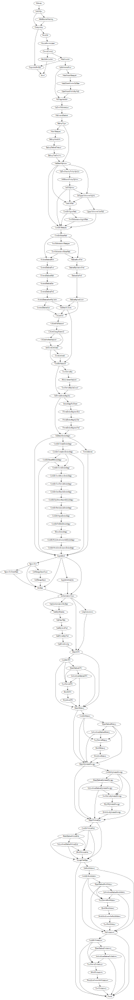

# Deploy Code Dx on Kubernetes

Running guided-setup.ps1 is the recommended way to deploy Code Dx on Kubernetes (requires [PowerShell Core 7](https://docs.microsoft.com/en-us/powershell/scripting/install/installing-powershell?view=powershell-7)). The script will help you specify the correct setup.ps1 script parameters for installing Code Dx on your Kubernetes cluster.

## Prerequisites

Code Dx supports a minimum Kubernetes version of 1.14 if you're not using AWS EKS; otherwise, the minimum Kubernetes version is 1.16.

You must run guided-setup.ps1 from a system with administrative access to your cluster. Copy the following prerequisite programs to directories that are included in your PATH environment variable:

- [git](https://git-scm.com/book/en/v2/Getting-Started-Installing-Git)
- [PowerShell Core 7](https://docs.microsoft.com/en-us/powershell/scripting/install/installing-powershell?view=powershell-7)
- [kubectl](https://kubernetes.io/docs/tasks/tools/install-kubectl/) (a version that matches the major.minor version of your k8s cluster)
- [openssl](https://www.openssl.org/)
- [helm v3.1+](https://github.com/helm/helm/releases/tag/v3.2.4) - Download the Helm release for your platform and extract helm (or helm.exe).
- [keytool](https://adoptopenjdk.net/) - The keytool application is bundled with the Java JRE.
  If your Code Dx deployment requires specifying a path to a cacerts file, use the cacerts file from a Java 8 JRE install.
- [kubeseal](https://github.com/bitnami-labs/sealed-secrets/releases) - Required when using Helm Operator and Bitnami's Sealed Secrets.
>Note: On Windows, make sure that you can run PowerShell Core scripts by switching your [PowerShell Execution Policy](https://docs.microsoft.com/en-us/powershell/module/microsoft.powershell.core/about/about_execution_policies) to RemoteSigned (recommended) or Unrestricted. You must run the `Set-ExecutionPolicy -ExecutionPolicy RemoteSigned` command from an elevated/administrator Command Prompt.

## Pod Resources

Below are the default CPU, memory, ephemeral storage, and volume requirements you'll see when running guided-setup.ps1. Your deployment may not include every pod type listed, but make sure your cluster has sufficient capacity for your specific resource requirements.

| Pod              | CPU   | Memory | Ephemeral Storage | Volume Size |
| :---             | :---: | :---:  | :---:             | :---:       |
| Web              | 2000m | 8192Mi | 2048Mi            | 64Gi        |
| DB (master)      | 2000m | 8192Mi | -                 | 64Gi        |
| DB (subordinate) | 1000m | 8192Mi | -                 | 64Gi        |
| Nginx            | -     | 500Mi  | -                 | -           |
| Tool Service     | -     | 500Mi  | -                 | -           |
| MinIO            | 2000m | 500Mi  | -                 | 64Gi        |
| Workflow         | -     | 500Mi  | -                 | -           |
| Tools            | 500m  | 500Mi  | -                 | -           |

>Note: You may have more than one Tool Service pod, and orchestrated analyses can run multiple tools concurrently.

## Download Guided Setup

With prerequisites installed, open a Command Prompt/Terminal window and clone this repository on your system by running the following command from the directory where you want to store the codedx-kubernetes files:

```
git clone https://github.com/codedx/codedx-kubernetes.git
```

## Run Guided Setup

To run the guided setup script after cloning the codedx-kubernetes repository, change directory to codedx-kubernetes, and use pwsh to run guided-setup.ps1:

```
cd codedx-kubernetes
pwsh ./guided-setup.ps1
```

>Note: If running `pwsh ./guided-setup.ps1` generates errors mentioning unexpected tokens, run `pwsh ./guided-setup-check-prereqs.ps1` to test whether your system meets the PowerShell Core v7 prerequisite.

The guided setup script checks whether your system meets the prerequisites before gathering configuration data with a [series of steps](#guided-setup-steps) to help you specify the setup.ps1 parameters necessary to deploy Code Dx in your Kubernetes environment.

Finish the guided setup by either running the generated setup command or saving your setup command to one or more files. Saving your setup command is recommended and something that's required if you want to configure authentication with [LDAP](./setup/core/docs/auth/use-ldap.md) or [specify Code Dx property values](./setup/core/docs/config/codedx-props.md) in the [Code Dx Properties File](https://codedx.com/Documentation/InstallGuide.html#CodeDxPropertiesFile).

>Note: You can find a description of each setup command parameter [here](./setup/core#setup-script).

## Data Migration

If you are migrating from a Code Dx system created by the Code Dx Installer to a Code Dx Kubernetes deployment, follow the [data migration steps](./setup/core/docs/config/migrate-data.md) to move your data to Kubernetes.

## Upgrading

If you want the option of recovering from a failed upgrade by rolling back to a known good state, start a Code Dx backup and wait for it to finish before beginning an upgrade.

>Note: When using Velero Storage Provider Plugins, volume snapshots may complete after your Velero backup reports a completed status, so wait for snapshots to finish before proceeding.

You can start a Velero backup using the schedule you created. If you have not yet configured your Code Dx backup, refer to the [Code Dx Kubernetes Backup & Restore](./setup/core/docs/config/backup-restore.md) document for configuration details. For example, if the name of your Velero schedule is `codedx-schedule`, you can start a backup with this command:

```
velero backup create --from-schedule codedx-schedule
```

>Note: Remember to wait for both the backup and the volume snapshots to complete (they may finish at different times).

The codedx-kubernetes repository gets updated with each new Code Dx release, so you can download the latest repository files and re-run the setup commands you previously saved. If your setup.ps1 command references specific Docker image names (e.g., `-imageCodeDxTomcat codedx/codedx-tomcat:v5.0.8`), update those parameters to install the Docker image versions associated with a specific Code Dx release.

>Note: Refer to the changelog for a specific codedx-kubernetes release for any important notes regarding backward compatibility.

You can run the setup script commands multiple times. On subsequent runs with modified setup parameters, depending on what you changed, you may need to restart a system component like the Code Dx web application pod. For example, restarting the Code Dx web application pod is necessary when changing a codedx.props setting with a custom values.yaml file so that Code Dx can observe the new file contents.

### Upgrade Rollback

You can recover from a failed upgrade by restoring the Code Dx backup you created before upgrading Code Dx. Run the following command to find the backup you want to restore:

```
velero backup get
```

Velero will skip restoring resources that already exist, so delete the resources you want to revert before starting a restore. You can delete the Code Dx namespace(s) to remove all namespaced resources, and you can delete cluster scoped Code Dx resources to remove Code Dx entirely. Since Code Dx depends on multiple PersistentVolume resources, you should always delete Code Dx PersistentVolume resources when restoring Code Dx to a previous known good state.

Refer to the [Code Dx Kubernetes Backup & Restore](./setup/core/docs/config/backup-restore.md#restoring-code-dx) document for details on how to restore Code Dx from a Velero backup.

## Troubleshooting

If you encounter a problem with your Code Dx Kubernetes deployment, contact Code Dx Support by visiting https://codedx.com/support/. You can also check out the codedx-kubernetes [Troubleshooting](https://github.com/codedx/codedx-kubernetes/wiki/Troubleshooting) wiki page.

## Uninstalling

Follow the steps below to uninstall Code Dx from your cluster, replacing `cdx-app` and `cdx-svc` with your Code Dx Kubernetes namespaces.

1. Delete the Code Dx Helm release: helm -n cdx-app delete codedx
2. Delete the Code Dx Tool Orchestration release, if it exists: helm -n cdx-svc delete codedx-tool-orchestration
3. Delete the Code Dx k8s namespace: kubectl delete ns cdx-app
4. Delete the Code Dx Tool Orchestration k8s namespace, if it exists: kubectl delete ns cdx-svc
5. Delete any remaining Persistent Volumes (PV) and any related PV data

## Guided Setup Steps

Below is a graph that shows every step of the guided setup script - you only have to visit the steps that apply to your Code Dx deployment.


