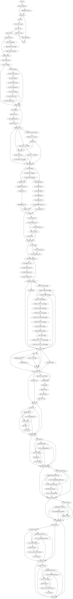

# Deploy Code Dx on Kubernetes

Running guided-setup.ps1 is the recommended way to deploy Code Dx on Kubernetes (requires [PowerShell Core 7](https://docs.microsoft.com/en-us/powershell/scripting/install/installing-powershell?view=powershell-7)). The script will help you specify the correct setup.ps1 script parameters for installing Code Dx on your Kubernetes cluster.

## Prerequisites

You must run guided-setup.ps1 from a system with administrative access to your cluster. Here are the script prerequisites:

- [git](https://git-scm.com/book/en/v2/Getting-Started-Installing-Git)
- [PowerShell Core 7](https://docs.microsoft.com/en-us/powershell/scripting/install/installing-powershell?view=powershell-7)
- [kubectl](https://kubernetes.io/docs/tasks/tools/install-kubectl/)
- [openssl](https://www.openssl.org/)
- [keytool](https://adoptopenjdk.net/) - The keytool application is bundled with the Java JRE.
- [helm v3.1+](https://github.com/helm/helm/releases/tag/v3.2.4) - Download the Helm release for your platform and extract helm (or helm.exe) to a directory in your PATH environment variable.

Make sure that you can run PowerShell Core scripts by switching your [PowerShell Execution Policy](https://docs.microsoft.com/en-us/powershell/module/microsoft.powershell.core/about/about_execution_policies) to RemoteSigned (recommended) or Unsigned.

>Note: On Windows, you must run the `Set-ExecutionPolicy -ExecutionPolicy RemoteSigned` command from an elevated/administrator Command Prompt.

## Download Guided Setup

With prerequisites installed, open a Command Prompt/Terminal window and clone this repository on your system by running the following command from the directory where you want to store the codedx-kubernetes files:

```
git clone https://github.com/codedx/codedx-kubernetes.git -b feature/guide
```

## Run Guided Setup

To run the guided setup script after cloning the codedx-kubernetes repository, change directory to codedx-kubernetes, and use pwsh to run general-setup.ps1:

```
cd codedx-kubernetes
pwsh ./guided-setup.ps1
```

The guided setup script checks to see whether your system meets the prerequisites before gathering configuration data with a [series of steps](#guided-setup-steps) to help you specify the setup.ps1 parameters necessary to deploy Code Dx in your Kubernetes environment.

## Guided Setup Steps

Below is a graph that shows every step of the guided setup script - you only have to visit the steps that apply to your Code Dx deployment.


