# Deployment of Kubernetes and Code Dx to Microsoft Azure

This document covers instructions for creating a Kubernetes cluster on Azure using the az aks utility, additional configuration steps after deployment of the cluster such as Helm and NGINX Ingress, and instructions on configuring and installing Code Dx to the cluster.

Cluster creation is a platform-dependent process – deployment instructions for Azure should not be carried to other platforms, though post-deployment configuration can be safe to use on other clusters after considering any additional requirements.

### Included Files

This document should be accompanied by the following files, used as examples or for configuration:

-	[codedx-values.yaml](resources/codedx-values.yaml)
-	[create-cluster.sh](resources/create-cluster.sh)
-	[production-issuer.yaml](resources/production-issuer.yaml)
-	[staging-issuer.yaml](resources/staging-issuer.yaml)

# Table of Contents

- [Cluster Provisioning](#cluster-provisioning)
    - [Requirements](#requirements)
    - [Considerations](#considerations)
    - [Instructions](#instructions)
        - [Review and Modify the Install Script](#review-and-modify-the-install-script)
        - [Run the Install Script](#run-the-install-script)
        - [Confirm a Successful Deployment](#confirm-a-successful-deployment)
        - [Connect and Test Your Cluster](#connect-and-test-your-cluster)
- [Additional Cluster Setup](#additional-cluster-setup)
    - [Installing Helm](#installing-helm)
        - [Installation](#installation)
    - [Installing nginx-ingress](#installing-nginx-ingress)
        - [What is nginx-ingress?](#what-is-nginx-ingress)
        - [Reserving a Public IP](#reserving-a-public-ip)
        - [Installation](#installation-1)
    - [Installing cert-manager](#installing-cert-manager)
        - [What is cert-manager?](#what-is-cert-manager)
        - [Installation](#installation-2)
        - [Creating Cert Issuers](#creating-cert-issuers)
- [Installing Code Dx](#installing-code-dx)
    - [Configuration](#configuration)
    - [Installation](#installation-3)
        - [Monitor Installation Status](#monitor-installation-status)
            - [Ingress](#ingress)
            - [TLS/cert-manager](#tlscert-manager)
        - [Connect to Code Dx](#connect-to-code-dx)
            - [Change from Staging to Production Cert Issuer](#change-from-staging-to-production-cert-issuer)
        - [First Log-in](#first-log-in)
        - [Installation Complete](#installation-complete)
- [Modifying/Upgrading Code Dx](#modifyingupgrading-code-dx)
- [Uninstalling Code Dx](#uninstalling-code-dx)
- [Helpful Commands](#helpful-commands)

## Cluster Provisioning

### Requirements

You must have access to the Azure CLI within a Bash environment (either via local connection or https://shell.azure.com) and have permissions to create resource groups and other resources within your subscription. This document will assume the online Azure shell at https://shell.azure.com is being used. **If using Azure Cloud Shell, we strongly recommend using Microsoft Edge or the latest available version Internet Explorer to access it.** We’ve personally experienced issues when using the Azure Cloud Shell with Google Chrome. We have no comments on use of other browsers such as Firefox

### Considerations

Cluster deployment in this guide will enable Network Policies in the cluster, which acts as a set of firewall rules for communication between pods. Connections within the cluster are isolated from external networks through the internal Kubernetes networking layer, but connections between pods within the cluster itself are not restricted. Kubernetes applications with Network Policies defined provide an extra layer of security in preventing connections, particularly useful if a malicious actor becomes able to create a pod within the cluster.

Network Policies in Azure are disabled by default and cannot be enabled through the “New Resource” UI in the Azure Portal but can be enabled if creating the cluster using `az aks` command line utility. Network Policies cannot be enabled on a cluster after it is created.

We recommend enabling Network Policies for improved security. If creating a cluster without Network Policies, you can use the Azure Portal to create a cluster resource to the same effect. Configuration in that interface can be left to its defaults, with a minimum of 2 nodes and a node size minimum of 2 cores and 8GB of memory.

The remainder of this section will cover the commands and resources necessary for creating a Kubernetes cluster via CLI with Kubernetes Network Policies enabled.

### Instructions

_Information in this section is based on the Microsoft documentation article “Use Network Policies” - https://docs.microsoft.com/en-us/azure/aks/use-network-policies_

#### Review and Modify the Install Script

Open the provided `create-cluster.sh` file in a text editor, which will configure and deploy the necessary Azure resources. Configuration properties and their descriptions are at the top of the file. This file can be ran with defaults, assuming it hasn’t been ran already.

#### Run the Install Script

Copy your `create-cluster.sh` file to your Azure shell environment and run it with `sh create-cluster.sh`. The installation will take a few minutes to complete. Do not close the azure shell or terminate the process while it’s running. If your shell disconnects during the process, please wait for up to 15 minutes and monitor your Azure resources in case the command has continued to run.

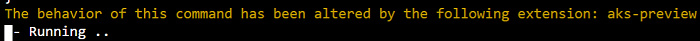

_Figure 1 - Text output of the `az aks create` command in the `create-cluster.sh` file_

Once complete, the command should output JSON describing the cluster resource that was created.

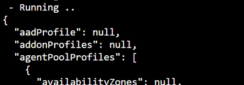

_Figure 2 - Text output of “az aks create” command in the create-cluster.sh file_

If any errors occur during deployment, make sure to delete any resources that were created before trying again. If the Cluster resource was created and you see a new "MC_" resource group with a similar name to the one used for your cluster, then:

1.	Delete the cluster resource
2.	Wait for the deletion operation to complete; the “MC_” resource group should automatically be removed after the Cluster resource is removed
3.	Delete the resource group that was created by the script

#### Confirm a Successful Deployment

Once completed, you should see a new resource group with the name provided from the `RESOURCE_GROUP_NAME` option in the script, which contains your Kubernetes cluster resource and VNet resource. There should also be a second resource group with a name starting with “MC_”, followed by the name of the cluster’s resource group and the name of the cluster resource itself. This MC resource group should contain The Virtual Machines for your Kubernetes nodes, an availability set, and other supporting resources. When the MC resource group is populated and all nodes have started, your Cluster deployment is complete.

It may take a few minutes for all resources to be generated after the script completes.

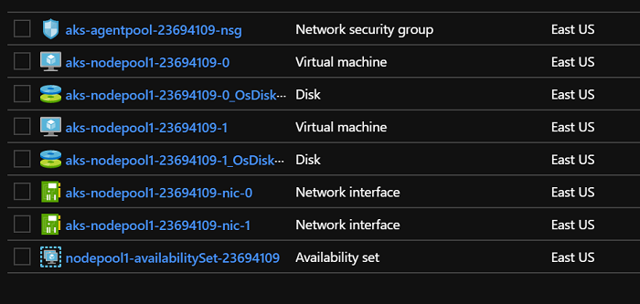

_Figure 3 - All deployed resources for the created cluster in its “MC_” resource group_

#### Connect and Test Your Cluster

In the Azure cloud shell, run the command to import your Kubernetes cluster connection information locally:

```bash
az aks get-credentials --resource-group $RESOURCE_GROUP_NAME --name $CLUSTER_NAME
```

... where `RESOURCE_GROUP_NAME` and `CLUSTER_NAME` match the values assigned in your `create-cluster.sh` script.

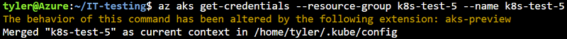

_Figure 4 – Example and results of "az aks get-credentials" command_

You can then run the following commands to check your cluster:

1. `kubectl get nodes` - Lists the nodes in your cluster. All nodes should be listed and should reach the “Ready” status. If a node is “NotReady”, check that the VM for that node has started. It can take a few minutes for a node to become “Ready”.
2. `kubectl get pods --all-namespaces` - Lists the “pods” in your cluster, which are sets of containerized applications running on Kubernetes. All pods listed should reach the “1/1 READY” state with a “STATUS” of “Running”. Some pods depend on others and may crash initially, run the same command with the --watch parameter to monitor the state of the pods and wait for them to start.

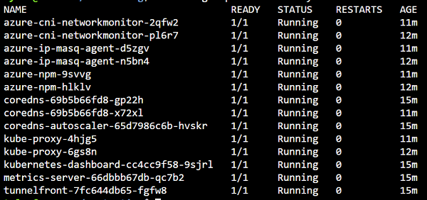

_Figure 5 - Output of “kubectl get pods --all-namespaces” after all pods have completed startup_

## Additional Cluster Setup

We will now install:

-	_Helm_: a Kubernetes package manager
-	_nginx-ingress_: enables Kubernetes “ingress” objects which let us expose multiple applications on the same port, routed by hostname and path
-	_cert-manager_: (optional) can automatically provision TLS certs from a trusted CA

### Installing Helm

[Helm](https://helm.sh/docs/intro) is a commonly used Kubernetes package manager that we will use to install _cert-manager_, _nginx-ingress_, and finally Code Dx. It deploys Kubernetes resources defined in the package based on user-provided values. For example, we can use Helm to install the Code Dx “chart”, which will deploy a MariaDB database, Code Dx web application, request storage volumes, and link these resources together so they can communicate properly. We can use properties provided by the chart to, for example, change the registered hostnames for an application, and it will take those customizations into account accordingly.

#### Installation

The Azure Cloud Shell comes with the helm command executable pre-installed. Run helm version to confirm that you have Helm v3 installed.

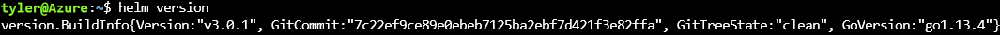

_Figure 6 - Output of “helm version” indicating helm v3_

If you do not have Helm v3 pre-installed, download helm v3 from the [helm releases](https://github.com/helm/helm/releases) page.

### Installing nginx-ingress

-	https://github.com/helm/charts/tree/master/stable/nginx-ingress

#### What is nginx-ingress?

A Kubernetes Ingress will be used to allow multiple web applications to run on the same IP and provide HTTPS services. An Ingress resource defines the hostnames and base endpoints to manage, the application to forward to, and TLS options. However, an Ingress resource on its own is only a “request” for these features; Kubernetes allows Ingresses to be made but does not handle them directly. Instead, it requires that an Ingress Controller be installed to the cluster, which can monitor these requested resources and act accordingly.

In this document we will be using the nginx-ingress implementation for our Ingress Controller. Nginx-ingress is a widely used and flexible controller, with advanced NGINX-specific routing options available as annotations on an ingress.

#### Reserving a Public IP

Connecting to the NGINX Ingress controller requires an IP address to make the connection. The Ingress controller will be connected through an Azure LB (Load Balancer) that gets automatically provisioned, but the IP address of the LB can change over time. We will reserve a static, public IP to use for NGINX’s LB.

In the Azure Web Portal (https://portal.azure.com), navigate to the “MC” Resource Group for your cluster that contains your node VMs. Click “Add” and create a new “Public IP Address” resource.

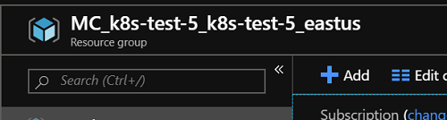

_Figure 7 - Displaying the "MC_" resource group and "Add" button to be used_

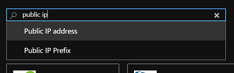

_Figure 8 - Search "public ip" in the resource creation window to display the "Public IP address" option_

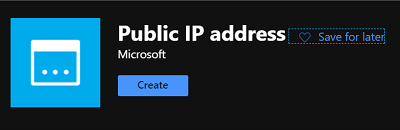

_Figure 9 - Resource creation page for a "Public IP address"_

It should use an IPv4 address, Basic SKU, Static IP, and have the same Location as your nodes.

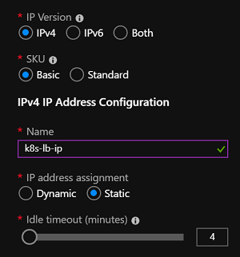

_Figure 10 - Configuration for Public IP address resource; "IP address assignment" has been set to "Static"_

Once the static IP has been created, inspect it in the Azure Portal to retrieve its address. We will use this when installing the NGINX Ingress controller.

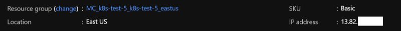

_Figure 11 - View of the created "Public IP address" resource and the address assigned to it_

#### Installation

We will use Helm to install the NGINX Ingress controller and its resources. Use the following command:

```bash
helm install \
   stable/nginx-ingress \
   --name nginx \
   --namespace nginx \
   --set controller.service.loadBalancerIP=<RESERVED-IP>
```

... where `<RESERVED-IP>` should be replaced with the static IP you created in the previous section.

When the command completes, use `kubectl get pods -n nginx --watch` to watch the NGINX pods start. Use `kubectl get svc -n nginx --watch` to check that the LoadBalancer service was created with its “EXTERNAL-IP” assigned to our static IP. This association can take a few minutes to complete.

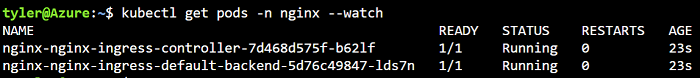

_Figure 12 - Using "kubectl get pods" to check the status of the new NGINX Ingress pods in the "nginx" namespace_

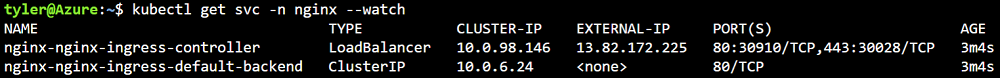

_Figure 13 - Using "kubectl get svc" to check that the "Public IP address" resource was successfully assigned to the LoadBalancer service after 3 minutes_

When the LoadBalancer has been assigned its static IP and the NGINX pods have reached a “1/1 READY” status, you can open your browser and navigate to `http://<STATIC-IP>` to confirm that NGINX is listening at that IP. You should see a mostly-blank page, with the text “default backend – 404”. If you see this text, installation has completed.

At this point it is recommended to create any DNS A records for your web services using this IP. While we can connect using IP, Kubernetes Ingress only officially supports requests using hostname – applications may not be available if you try to access by IP directly due to Ingress routing by hostname.

### Installing cert-manager

-	https://github.com/jetstack/cert-manager
-	https://docs.cert-manager.io/en/latest/

_Note: This step can be skipped if you plan to provide your own TLS certificates for HTTPS._

#### What is cert-manager?

The _cert-manager_ package will “automate the management and issuance of TLS certificates from various issuing sources.” In our case, it monitors Ingress resources and can automatically provision TLS certificates for those Ingresses to enable HTTPS. With cert-manager, you can enable HTTPS on an Ingress by simply adding a single annotation to your Ingress. This annotation will specify what Issuer to use, and cert-manager will handle the rest of the configuration to create a cert for the hostnames specified in the Ingress.

In this section we will use Let’s Encrypt (https://letsencrypt.org) as our issuer to automatically create and renew our TLS certs. You can check the cert-manager documentation if you want to use a different issuer.

#### Installation

We will be following the documentation provided by the cert-manager project: https://docs.cert-manager.io/en/latest/getting-started/install/kubernetes.html#installing-with-helm

Before installing cert-manager with helm, we must create the CustomResourceDefinition objects that it requires:

```bash
kubectl apply \
    -f https://raw.githubusercontent.com/jetstack/cert-manager/release-0.10/deploy/manifests/00-crds.yaml
```

_Check the cert-manager docs for the latest version of that command to run._

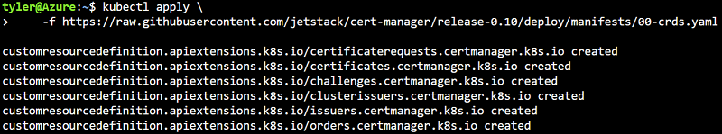

_Figure 14 – Command output after creating the cert-manager CustomResourceDefinitions_

Then you’ll need to add the JetStack helm repository, since the cert-manager package isn’t available on the default repository:

```bash
helm repo add jetstack https://charts.jetstack.io
```

Finally, we can install cert-manager:

```bash
helm install cert-manager --namespace cert-manager jetstack/cert-manager
```

Use `kubectl get pods -n cert-manager --watch` to monitor the status of the deployment. Installation is complete when all pods in that namespace reach “1/1 READY”.

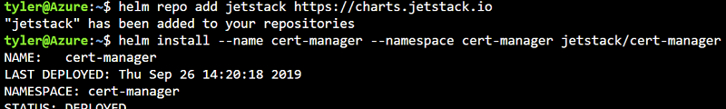

_Figure 15 - Partial output of the "helm install" command for cert-manager_

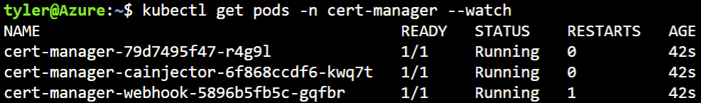

_Figure 16 - Using "kubectl get pods" to check the status of the new cert-manager pods_

#### Creating Cert Issuers

The cert-manager package uses _Issuers_ to create and renew certificates. If you run `kubectl get clusterissuer`, it won’t return any resources.

We will create two ClusterIssuers, which can create certs for any namespace in the cluster – one issuer for Let’s Encrypt Staging, and one for Let’s Encrypt Production. The Production issuer has rate limiting and may lock you out for a time if you use it while setting up your services. When we install Code Dx, we will use the Staging issuer until we get everything working and will switch to the Production issuer afterwards. Issuers can be changed on an Ingress without needing to restart the application.

We will be using the resources provided by the cert-manager quick-start guide: https://docs.cert-manager.io/en/latest/tutorials/acme/quick-start/index.html#step-6-configure-let-s-encrypt-issuer

The Issuer files have been included with this document – staging-issuer.yaml and production-issuer.yaml¬ – which have been slightly modified to create ClusterIssuers instead of Issuers. By using a ClusterIssuer, we can use these same issuers across any namespace.

**Important: Open the staging-issuer.yaml and production-issuer.yaml files in a text editor, then modify the “email” field with a valid email in each file.**

Copy the staging-issuer.yaml and production-issuer.yaml files to your Azure Cloud Shell environment, and apply them with:

```bash
kubectl create -f staging-issuer.yaml
kubectl create -f production-issuer.yaml
```

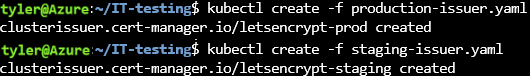

_Figure 17 - Command output after creating the Staging and Production ClusterIssuer resources_

After these have been created, you can run `kubectl get clusterissuer` to see that the issuers were successfully installed and `kubectl describe clusterissuer letsencrypt-staging letsencrypt-prod` to confirm there are no errors. These won’t do anything yet, but we’ll refer to these by name when configuring the Code Dx Ingress.

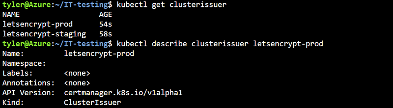

_Figure 18 - Confirming that the ClusterIssuers were created and using "kubectl describe clusterissuer" to check the status of the "letsencrypt-prod" issuer (partial command output is displayed)_

## Installing Code Dx

-	https://github.com/codedx/codedx-kubernetes/tree/master/codedx

### Configuration

We will use the Code Dx helm chart for installation and provide a values.yaml file to customize it.

Run the following command to add the Code Dx Helm repository, since the chart is unavailable on the default repositories:

```bash
helm repo add codedx https://codedx.github.io/codedx-kubernetes
```

Then open the provided _codedx-values.yaml_ file in a text editor to make a few changes. The full list of available options and their uses are documented in the Code Dx Helm repository’s README file, with examples provided in the _sample-values_ folder: https://github.com/codedx/codedx-kubernetes/tree/master/codedx/sample-values

**You must edit the following sections:**

-	_hosts_ – Change the hostname for the entry provided at the end of the file to the hostname you assigned to the public IP for your NGINX Load Balancer

Licensing can be done through configuration in these values, or after installation has completed. Further options are given in the _codedx-values.yaml_ file.

### Installation

Copy your codedx-values.yaml file to your Azure Cloud Shell environment and run the command:

```bash
helm install codedx codedx/codedx -f codedx-values.yaml
```

If the installation completes successfully, you must **immediately** run the following command to get the randomly generated password for the default “admin” account:

```bash
kubectl get secret --namespace default codedx-admin-secret -o jsonpath="{.data.password}" | base64 --decode
```

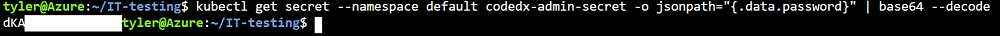

_Figure 19 - Example command and partial output for retrieving the randomly-generated Code Dx Admin password_

... if you gave your Code Dx installation a different name or installed to a different namespace, you can find the appropriate command in the output of the helm install command.

**If you do not record the default password before making any further changes you are at risk of losing access to the installation entirely.** The password is randomly generated, but due to a quirk in Helm, making any configuration changes to Code Dx also re-generates the password. This is stored in a Kubernetes Secret, but Code Dx ignores this change once installation is complete. If you make a change to Code Dx without recording the password, it cannot be recovered and Code Dx will need to be uninstalled and reinstalled.

#### Monitor Installation Status

Use `kubectl get pods --watch` to see the MariaDB and Code Dx pods start. This can take up to 15 minutes on a new cluster, since Kubernetes needs to download the necessary Docker images to run the applications and Code Dx needs to initialize the database. If any errors occur, use `kubectl describe pod <pod-name>` to get more detailed information for troubleshooting.

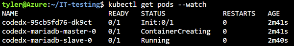

_Figure 20 - Using "kubectl get pods" to check the status of the new pods created by the Code Dx chart_

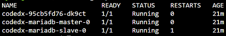

_Figure 21 - Example output of a successful initialization of MariaDB and Code Dx. The MariaDB "slave" has restarted once and finished its initialization successfully_

The applications have started once they’ve reached the “0/1 READY” state and will be ready once they’ve reached “1/1 READY”. You can use `kubectl logs -f <pod-name>` to monitor the logs of any of the pods. Use `kubectl get networkpolicy` and check that there are three policies created – one for Code Dx, one for MariaDB Master, and one for MariaDB Slave.

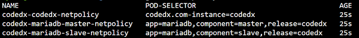

_Figure 22 - Using "kubectl get networkpolicy" to confirm that the NetworkPolicy resources were deployed by the Code Dx chart_


##### Ingress

Use kubectl get ing to check that the Ingress resource was created appropriately. Use `kubectl describe ing <ingress-name>` to confirm that there are no reoccurring error messages.

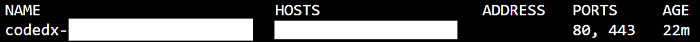

_Figure 23 - Using "kubectl get ing" to confirm that the Ingress resource was created properly by the Code Dx chart_

##### TLS/cert-manager

If using cert-manager, use kubectl get certs to check that a Certificate was automatically created for your Ingress. When the certificate is provisioned, the “READY” state will be set to “True”. Use kubectl describe cert <cert-name> to get information on the progress of provisioning and to troubleshoot any errors that may have occurred.

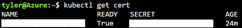

_Figure 24 - Using "kubectl get certs" to check that cert-manager automatically provisioned a certificate for our Ingress. The cert has its "READY" state set to "True", and will be used automatically by our Ingress_


#### Connect to Code Dx

Once installation is complete, Code Dx should be available at the hostname specified in your Ingress under “/codedx”, eg “http://mycodedx.com/codedx”. Use HTTPS if you’ve enabled TLS on your Ingress.

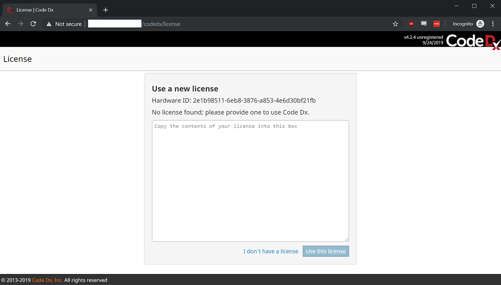

_Figure 25 - Code Dx web page after installation has completed. The browser warns that the HTTPS connection is "Not secure", due to the use of the Let's Encrypt Staging issuer which uses an untrusted CA. Code Dx was installed without a license, causing it to prompt for a license before use_

##### Change from Staging to Production Cert Issuer

If using cert-manager, we’ve configured it with the staging issuer which will provision a certificate with an untrusted CA. Once you’ve confirmed that you can connect to Code Dx, you can modify the codedx-values.yaml file and change “letsencrypt-staging” to “letsencrypt-prod”.

**Before continuing, make sure the Code Dx admin password has been retrieved and stored.**

Run a helm upgrade command to modify the existing installation with your new values:

```bash
helm upgrade codedx codedx/codedx -f codedx-values.yaml
```

Then run `kubectl get cert` to see that the TLS certificate has had its “READY” state set back to “False” while the provisioner does its work. Use `kubectl get cert --watch` and wait for it to change back to “True”. Once complete, navigate to your Code Dx URL again and refresh to use the new, trusted certificate.

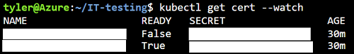

_Figure 26 - The existing Certificate has been reset after changing the ClusterIssuer assigned to it. Its "READY" state has returned to "False" while regenerating the cert, and is automatically updated to "True" after successful provisioning_

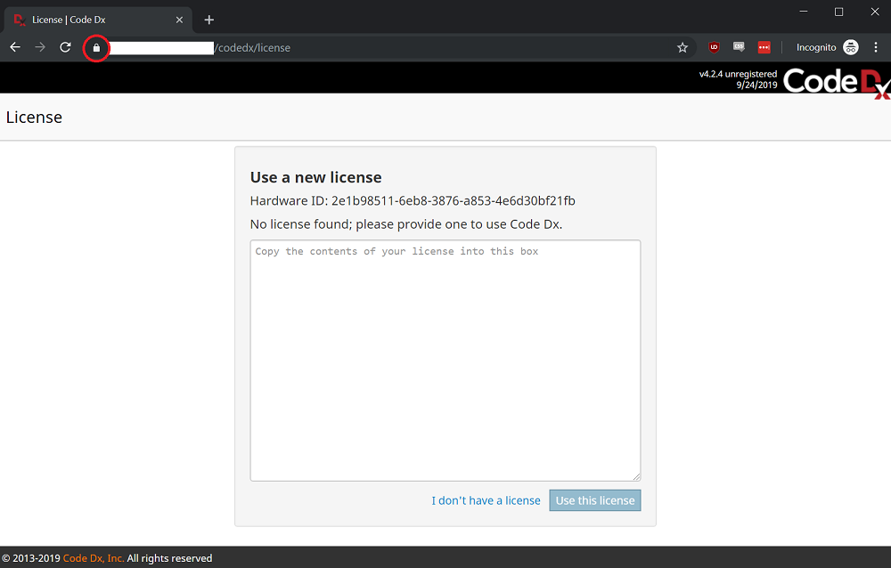

_Figure 27 - The Code Dx web page no longer creates the "Not secure" message due to using the Let's Encrypt Production issue with a trusted CA_

#### First Log-in

If you provided a license during installation, you will be presented with the Code Dx sign-in page. If not, you’ll be prompted for a license.

Once you get to the login page you can sign in with the user “admin” and the password retrieved during the first installation steps.

**Navigate to the Admin page and change the password for the “admin” account, so that it can more easily be accessed later.**

#### Installation Complete

At this point we have deployed a working Code Dx installation, and you can move forward with adding users and projects. Keep your customized codedx-values.yaml file in a reliable location so it can be accessed later if you need to make changes.

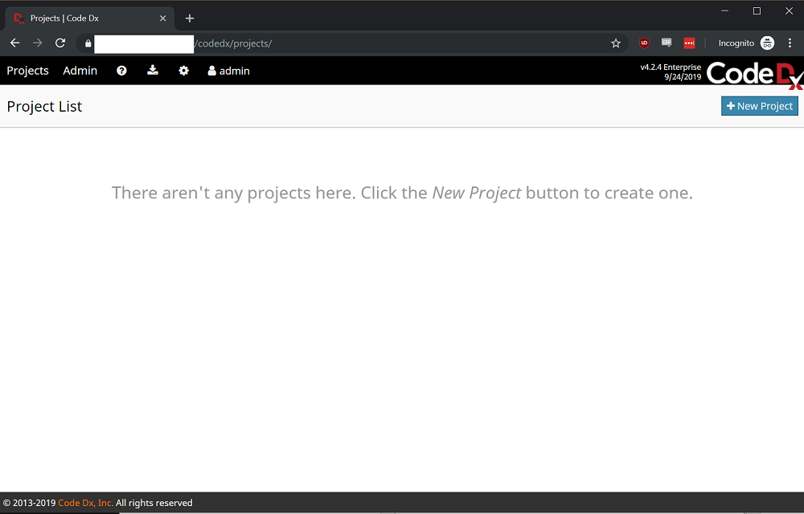

_Figure 28 - Code Dx "Projects" page after providing a license and signing in with the "admin" user and password generated during installation_


## Modifying/Upgrading Code Dx

For the full set of configuration options and samples, visit the Code Dx helm chart repository:

-	https://github.com/codedx/codedx-kubernetes/tree/master/codedx
-	https://github.com/codedx/codedx-kubernetes/tree/master/codedx/sample-values

Any further changes should be made in your existing codedx-values.yaml file. Options can be provided to Helm through the --set parameter, but Helm does not preserve previous configurations by default. Forgetting an option when performing a change will cause Helm to reset that value to its default when executing. For this reason, _we highly recommend maintaining and modifying a single values.yaml file for configuring Code Dx consistently._

You can use the following command to apply any changes:

```bash
helm upgrade codedx codedx/codedx -f codedx-values.yaml
```

_Note: If you used a different namespace during installation, it does not need to be specified again for upgrade operations._

## Uninstalling Code Dx

Use the following command to remove Code Dx and its resources from your cluster:

```bash
helm del --purge codedx
```

For technical reason, the storage volumes for MariaDB will remain after Code Dx is removed. These must be removed manually.
Check which volumes are remaining with:

```bash
kubectl get pvc
```
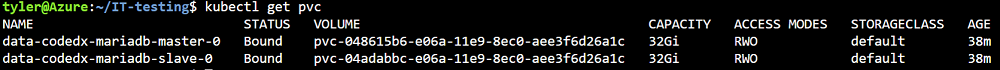

_Figure 29 - Using "kubectl get pvc" to check that the MariaDB PVCs still remain after uninstalling Code Dx from the cluster_

... then delete the MariaDB volumes with:

```bash
kubectl delete pvc <master-pvc-name> <slave-pvc-name>
```

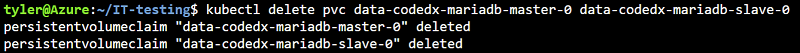

_Figure 30 - Using "kubectl delete pvc" to manually delete the storage volumes_

## Helpful Commands

_Some common helpful commands and troubleshooting steps for working with your cluster._

`kubectl top node` / `kubectl top pod` – Shows CPU and memory usage on a per-node or per-pod basis

`kubectl describe <type> <resource>` – Provides detailed information on the definition, status, and events for a given resource

`kubectl exec -it <pod-name> <command>` - Executes the given `<command>` natively on the specified pod. The `<command>` can be `/bin/bash` or `/bin/sh` to gain access to a terminal running in the container itself.

`kubectl logs -f <pod-name>` - Provides a real-time output of the logs of the given application. Not all applications will output all logs through the necessary channel for this, so connecting to the pod and inspecting log files is necessary in some cases.

`kubectl edit <type> <resource>` - Opens an editor for the YAML definition of a deployed Kubernetes resource, which you can modify and save to change the resource directly. This uses the editor specified by the `$EDITOR` environment variable, which is unspecified by default and uses _vim_.

`helm list` – Lists charts currently installed on the cluster

`helm del --purge <name>` – Uninstalls the given application and allows reuse of the given `<name>` (by default, installation names cannot be reused later)

`helm repo update` – Updates the list of available charts and their versions from the registered repositories. New chart versions aren’t pulled automatically, you’ll need to do a repo update to get the latest changes.
